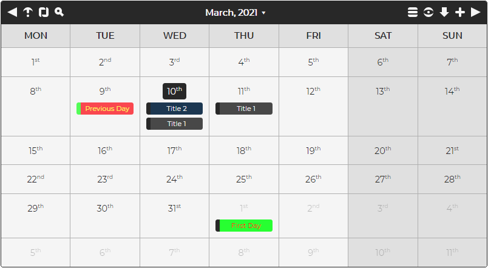

# Welcome to Calendar.js v1.1.1:

This is a JavaScript calendar library that is fully responsive and compatible with all modern browsers.

Features include:
- Adding, updating, and removing events, with full custom colors support.
- Full API available via public functions.
- Drag and Drop for events.
- Configurable text for translations.
- Day, Week, Month, and All Events views.
- Fully styled in CSS/SASS (including the buttons).
- Custom events for actions (adding/updating/removing events, skipping months, etc).
- Export to CSV, XML, JSON, TEXT, iCAL, MD, HTML, and TSV.
- Full-screen mode (double clicking the title bar).
- Search support.
- Repeat every Day, Week, Month, Year, or a custom period (with exclusion days support).
- Customizable holidays.
- Navigation keys (in full-screen mode):
  1. Left:  Moves to the previous month.
  2. Right:  Moves to the next month.
  3. Escape:  Close the active dialog, or full-screen mode.
  4. Down:  Jumps to the current month.
  5. F5:  Refreshes the current view.
  6. Ctrl/Command + Left:  Moves to the previous year.
  7. Ctrl/Command + Right:  Moves to the next year.
- Navigation keys (global):
  1. Escape:  Closes the active dialog.
  2. Ctrl/Command + Shift + A:  Opens the Add Event dialog (if manual editing is enabled).
  3. Ctrl/Command + Shift + F:  Opens the search dialog.
- Custom event groups (with configurable toggles).
- Browser notifications for events (modern browsers only).
- Drop file support (allowing a file containing JSON, or an array of events, to be added).
 

## Recent Changes:

To see all the latest changes, click [here](CHANGES.md).
 
 

## Options:

To see all the available options, click [here](OPTIONS.md).
 
 

## Event Object Format:

To see how an event object should be formatted, click [here](EVENT.md).
 
 

## Holiday Object Format:

To see how an holiday object should be formatted, click [here](HOLIDAY.md).
 
 

## Public Functions:

To see all the available public functions, click [here](FUNCTIONS.md).
 
 

## Getting Started:

To get started, download the source code and run the "calendarjs.html" file.  This will show an example of a calendar with most option enabled.

For further help with configuration, everything is documented in the unminimized "src/calendarjs.js" JavaScript file.