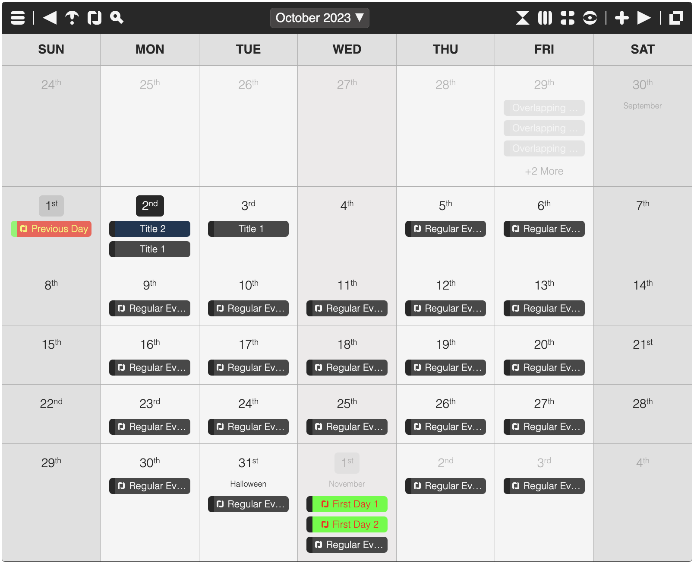

<h1 align="center">
Calendar.js

[](https://twitter.com/intent/tweet?text=Calendar.js%2C%20a%20free%20JavaScript%20library&url=https://github.com/williamtroup/Calendar.js&hashtags=calendar,javascript,responsive,events)
</h1>
<p align="center">One of the world's easiest, most powerful, and full responsive JavaScript Calendars!</p>
<p align="center">v1.8.7</p>
<br />



<h1>What features does Calendar.js have?</h1>

- Adding, updating, and removing events, with full custom colors support.
- Full API available via public functions.
- Drag and Drop for events.
- Cut, Copy, Paste, and Duplication of events.
- Configurable text for translations.
- Day, Week, Month, and All Events views.
- Fully styled in CSS/SASS (including the buttons) and compatible with the Bootstrap library.
- Custom triggers for actions (adding/updating/removing events, skipping months, etc).
- Export to CSV, XML, JSON, TEXT, iCAL, MD, HTML, and TSV.
- Full-screen mode (double clicking the title bar).
- Search support (with search history).
- Repeat every Day, Week, Month, Year, or a custom period (with exclusion days support).
- Customizable holidays.
- Navigation keys (in full-screen mode):
  1. Left:  Moves to the previous month.
  2. Right:  Moves to the next month.
  3. Escape:  Close the active dialog, or full-screen mode.
  4. Down:  Jumps to the current month.
  5. F5:  Refreshes the current view.
  6. Ctrl/Command + Left:  Moves to the previous year.
  7. Ctrl/Command + Right:  Moves to the next year.
- Navigation keys (global):
  1. Escape:  Closes the active dialog.
  2. Ctrl/Command + Shift + A:  Opens the Add Event dialog (if manual editing is enabled).
  3. Ctrl/Command + Shift + F:  Opens the search dialog.
- Custom event groups (with configurable toggles).
- Browser notifications for events (modern browsers only).
- Drop file support (allowing a file containing JSON, or an array of events, to be added).
- DatePicker mode (just assign to the ID of an text input).
- HTML text support (off by default).
- jQuery plugin for quickly creating Calendars.
- Data-Binding support to quickly create new Calendars without writing Javascript!
<br />
<br />

<h1>What browsers are supported?</h1>

All modern browsers (such as Google Chrome, FireFox, and Opera) are fully supported.

Limited support is still available for Internet Explorer. However, use within this browser is not recommended.
<br>
<br>

<h1>What are the most recent changes?</h1>

To see a list of all the most recent changes, click [here](CHANGES.md).
<br>
<br>

<h1>How do I get started?</h1>

To get started using Calendar.js, do the following steps:
<br>
<br>

### 1. Prerequisites:

You will also need to set the page character encoding to UTF-8. This can be included in the head of your HTML as follows:

```markdown
<meta charset="utf-8" />
```

Also, make sure you include the "DOCTYPE html" tag at the top of your email, as follows:

```markdown
<!DOCTYPE html>
```
<br>

### 2. Include Files:

```markdown
<link rel="stylesheet" href="dist/calendarjs.css" />
<script src="dist/calendarjs.js"></script>
```
<br>

### 3. Create DOM Container:

```markdown
<div id="calendar"></div>
```
<br>

### 4. Initialize Calendar.Js:

```markdown
<script> 
  var calendarInstance1 = calendarJs( "calendar", {
    manualEditingEnabled: true
    // All your options can be set here
  } );

  // OR
  var calendarElement = document.getElementById( "calendar" );
  var calendarInstance2 = calendarJs( calendarElement, {
    manualEditingEnabled: true
    // All your options can be set here
  } ); 
</script>
```

<br>

To see the options available for the class constructor, click [here](CLASS.md).  You can also create new Calendars using the jQuery Plugin, or by using Data Bindings.  See the test HTML files for examples.
<br>
<br>

### 5. Finishing Up:

That's it! Nice and simple. Please refer to the code if you need more help (fully documented).
<br>
<br>

<h1>How do I go about customizing Calendar.js and add events?</h1>

To customize, and get more out of Calendar.js, please read through following documentation.
<br>
<br>

### 1. Options:

Options (which can be set when initializing, or afterwards) allow you to customize how Calendar.js will look and function.  The options are also used to set the custom triggers you want to fire when specific actions occur.  You can set them manually as follows:

```markdown
<script> 
  calendarInstance.setOptions( {
      manualEditingEnabled: false,
      maximumEventsPerDayDisplay: 0,
      visibleDays: [ 0, 1, 2, 3, 4 ]
  } );
</script>
```

To see a list of all the available options you can use, click [here](OPTIONS.md).

To see a list of all the available custom triggers you can use, click [here](CUSTOM_TRIGGERS.md).
<br>
<br>

### 2. Event Object Format:

An event is defined as a JavaScript object, as follows:

```markdown
<script> 
  var event = {
      from: new Date(),
      to: new Date(),
      title: "A New Event",
      description: "A description of the event"
  };
</script>
```

You can add a new event by using one of the add public functions, as follows:

```markdown
<script> 
  calendarInstance.addEvent( event );
</script>
```


To see a list of all the available event properties and how they should be formatted, click [here](EVENT.md).
<br>
<br>

### 3. Holiday Object Format:

A holiday is a piece of text that is shown under the day number in the month it is assigned to.  You can set these holidays in the options, or add them manually as follows:

```markdown
<script> 
  var holiday1 = {
      day: today.getDate(),
      month: today.getMonth() + 1,
      title: "A New Holiday",
  };
  
  // This is a public function that you can call
  calendarInstance.addHolidays( [ holiday1 ] );
</script>
```

To see a list of all the available holiday properties and how they should be formatted, click [here](HOLIDAY.md).
<br>
<br>

### 4. Public Functions:

To see a list of all the public functions available, click [here](FUNCTIONS.md).
<br>
<br>

### 5. Search Options:

Search Options allow you to customize how Calendar.js Search dialog will function. You can set them manually as follows:

```markdown
<script> 
  calendarInstance.setSearchOptions( {
      matchCase: false
  } );
</script>
```

To see a list of all the available search options you can use, click [here](SEARCH_OPTIONS.md).
<br>
<br>